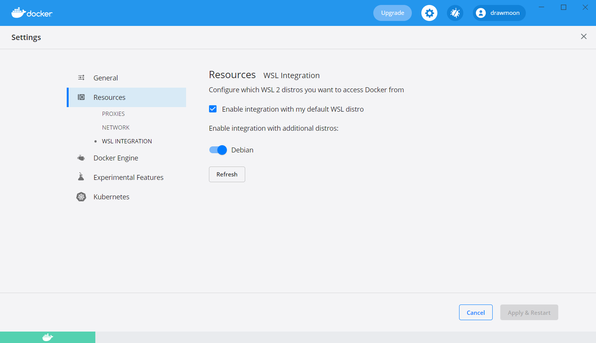

# Windows10 WSL

- [安装 WSL2](#安装-wsl2)
- [systemctl](#systemctl)
- [WSL 使用 Windows 的代理](#wsl-使用-windows-的代理)
- [WSL GUI](#wsl-gui)
- [在 WSL 中使用 Docker Desktop](#在-wsl-中使用-docker-desktop)

## 安装 WSL2

启用 WSL：

```powershell
dism.exe /online /enable-feature /featurename:Microsoft-Windows-Subsystem-Linux /all /norestart
```

启用 `虚拟机平台`：

```powershell
dism.exe /online /enable-feature /featurename:VirtualMachinePlatform /all /norestart
```

> 以上命令执行完成后重启计算机。

下载安装 [WSL2](https://wslstorestorage.blob.core.windows.net/wslblob/wsl_update_x64.msi)，设置 WSL2 为默认版本：

```powershell
wsl --set-default-version 2
```

在 Microsoft Store 中获取 [Debian](https://www.microsoft.com/zh-cn/p/debian/9msvkqc78pk6?activetab=pivot:overviewtab)。

安装完成后，启动 Debian 输入新的用户名与密码后，WSL2 就已经安装完毕了。

建议将 Debian 修改为国内的软件源，执行 `vim /etc/apt/source.list` 命令，修改为以下内容：

```bash
deb http://mirrors.huaweicloud.com/debian buster main
deb http://mirrors.huaweicloud.com/debian buster-updates main
deb http://mirrors.huaweicloud.com/debian-security/ buster/updates main
deb http://mirrors.huaweicloud.com/debian buster-backports main
```

## [systemctl](https://github.com/DamionGans/ubuntu-wsl2-systemd-script)

安装 Git

```bash
sudo apt install git
```

执行以下命令，克隆仓库并执行脚本：

```bash
git clone https://github.com/DamionGans/ubuntu-wsl2-systemd-script.git
cd ubuntu-wsl2-systemd-script/
bash ubuntu-wsl2-systemd-script.sh
```

脚本执行完成后重启 WSL，返回到 Windows 下，在终端中执行以下命令：

```bash
wsl --shutdown
```

验证 systemctl 是否工作：

```bash
systemctl
```

## WSL 使用 Windows 的代理

如果代理客户端使用的是 v2rayN，首先需要配置 v2rayN ☑ 允许来自局域网的连接。

### 临时配置代理

```bash
export hostip=$(cat /etc/resolv.conf |grep -oP '(?<=nameserver\ ).*')
export https_proxy="http://${hostip}:10809"
export http_proxy="http://${hostip}:10809"
```

### 编写脚本配置代理

```bash
# 修改配置文件，使用快捷指令启用
sudo vim ~/.zshrc
# or
# sudo vim ~/.profile

# proxy
alias setproxy='export hostip=$(cat /etc/resolv.conf |grep -oP '(?<=nameserver\ ).*');export http_proxy=${hostip}:10809;export https_proxy=$http_proxy'
alias unsetproxy='unset http_proxy;unset https_proxy'

source ~/.zshrc
# or
# source ~/.profile

# 启用代理
setproxy

# 禁用代理
unsetproxy
```

## WSL GUI

## 在 Windows 中启动 WSL 图形应用

> 使用 X 协议在 Windows 中渲染 Linux 应用图形界面。这里需要借助 MobaXterm 工具，并启用 X server。

安装 Xorg

```bash
sudo apt install xorg -y
```

使用 MobaXterm 连接 WSL，即可在 WSL 中启动图形界面应用。

如果遇到使用 MobaXterm 启动应用太慢的情况，可以尝试用以下方式启动应用：

- 下载并安装 Windows Terminal
- 打开 MobaXterm，点击首页的 Start local terminal
- 查看终端上方显示的 `Your DISPLAY is set to 192.168.1.1:0.0` 文字
- 在 Windows Terminal 中连接 WSL，并输入 `export DISPLAY=192.168.1.1:0.0`
- 随后就可以在 Windows Terminal 启动 WSL 图形界面应用

## 在 Windows 中启动 WSL 桌面

> 使用 X 协议在 Windows 中渲染 Linux 应用图形界面。这里需要借助 MobaXterm 工具，并启用 X server。

切换为中文环境：

```bash
sudo dpkg-reconfigure locales

# Locales to be generated:
# en_US.UTF-8 UTF-8
# zh_CN.UTF-8 UTF-8

# Default locale for the system environment:
# zh_CN.UTF-8
```

安装字体管理包

```bash
sudo apt update
sudo apt-get install fontconfig font-manager -y
```

安装中文字体

```bash
sudo mkdir -p /usr/share/fonts/windows
sudo cp -r /mnt/c/Windows/Fonts/*.ttf /usr/share/fonts/windows/
```

清除字体缓存

```bash
fc-cache
```

生成中文环境

```bash
sudo locale-gen zh_CN.UTF-8
```

安装中文输入法

```bash
sudo apt install fcitx dbus-x11 fcitx-googlepinyin -y
```

配置用户环境变量：

```bash
sudo vim /etc/profile.d/fcitx.sh

export GTK_IM_MODULE=fcitx
export QT_IM_MODULE=fcitx
export XMODIFIERS=@im=fcitx
```

> 如果遇到启动了 fcitx，并且已添加 Google 拼音输入法，却无法切换输入法，请尝试 [askubuntu](https://askubuntu.com/questions/1126451/unable-to-toggle-between-input-methods-using-fcitx) 上的回答解决该问题

安装 LXDE 桌面应用：

```bash
sudo apt install lxde -y
```

启动 LXDE：

```bash
lxsession
```

你也可以尝试安装其他的桌面应用：

```bash
# xfce4
sudo apt install xfce4 xfce4-goodies -y
# 启动
startxfce4

# Gnome
sudo apt install gnome ibus-rime -y
# 选择 gdm3
# 启动
gnome-shell

# KDE
sudo apt install kde-plasma-desktop -y
# 选择 sddm
# 启动
startkde
```

> 需要注意的是，有些桌面应用依赖 `systemd`，可以参考 [WSL systemctl](windows-wsl.md#systemctl) 启用 `systemd`

## 在 WSL 中使用 Docker Desktop

先决条件

- Windows 10 版本 1903 或更高的版本
- 在 Windows 上启用 WSL 2
- 在 Docker Desktop 中 **Settings > General**，已勾选 `Use the WSL 2 based engine`
- 确保在 Windows 中将 WSL 2 设置为默认版本，执行 `wsl -l -v` 查看所有的分发

转到 Docker Desktop **Settings > Resources > WSL Integration**，选择你想启用的 Linux 发行版



点击 **Apply & Restart** 重新启动 Docker Desktop 后，即可在 WSL 中使用 Docker 命令

完成以上步骤后，在 WSL 中没有用 `sudo` 执行 Docker 命令时会提示权限不足，需要将当前用户添加到 Docker 用户组

```bash
sudo usermod -aG docker $USER
```
