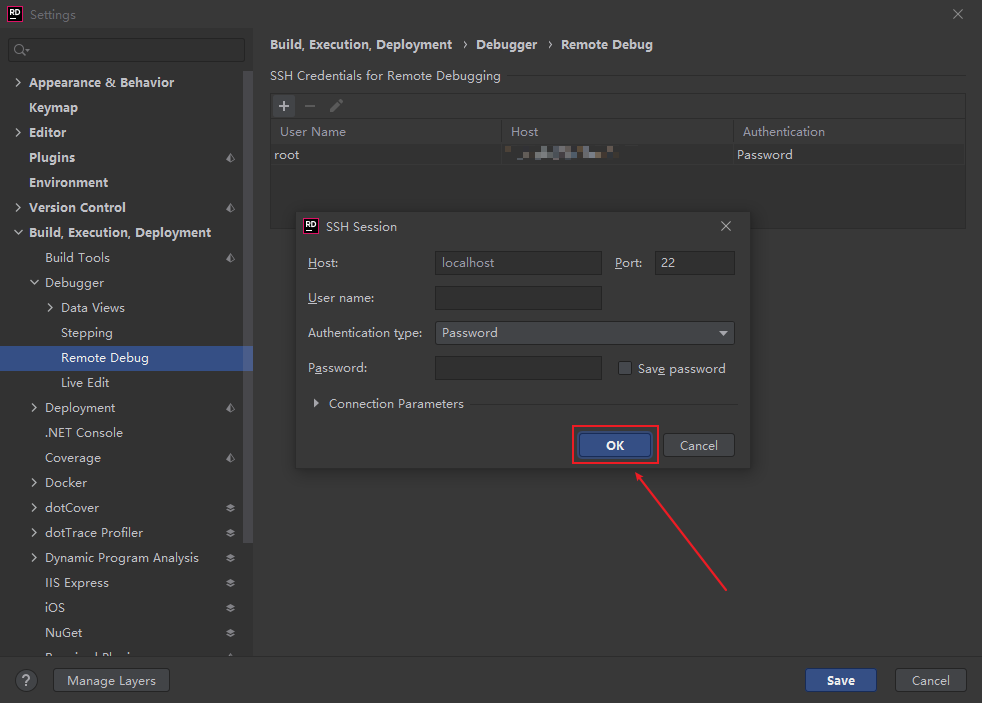
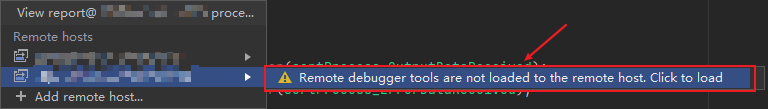
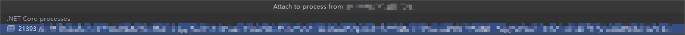

# Rider 远程调试

File > Settings > Build, Execution, Deployment > Debugger > Remote Debug


添加 SSH Session

```txt
Host: localhost Prot: 22
User name: root
Authentication type: Password
Password: root
```



Run > Attach To Remote Process...

安装 Remote Debug Tools



选择对应的进程


