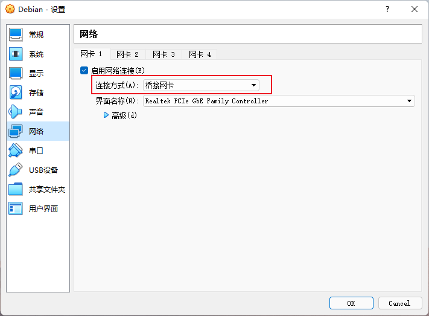

# Virtual Box + Debian 配置静态 IP

设置虚拟机的网络为桥接网络：



启动 Debian。

Debian 配置为静态 IP：

```bash
sudo vim /etc/network/interfaces
```

- 将 `dhcp` 修改为 `static`，`dhcp` 表示使用动态 IP， `static` 为静态 IP
- `address` 设置 IP 地址
- `netmask` 设置子网掩码
- `gateway` 设置网关


Debian 配置 DNS：

```bash
sudo vim /etc/resolv.conf
```

- `nameserver` 设置 DNS


